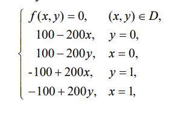

# Задача Дирихле для уравнения Пуассона

Поставленные задачи:

1. Реализовать паралельный алгоритм из книги В. П. Гергеля “Высокопроизводительные вычисления для многоядерных многопроцессорных систем”
2. Сравнить эффективность паралельного алгоритма на разном количестве потоков
3. Сравнить алгоритм с разными оптимизациями

[Результаты эксперимента](https://docs.google.com/spreadsheets/d/1N_TzEgzhA027rAAaFgmzLRgWxxU5YP4MSdoCUkXMoOg/edit#gid=0) 

### Условия
Эксперимент производился на 20 запусках, при $`eps = 0.1`$ и размере блоков $`50`$

Эксперимент проводился на компьютере с ОС ``Windows 10`` и процессором ``11th Gen Intel(R) Core(TM) i5-11400h @ 2.70Hz``

- GCC 13.1.0

## Краевая задача 

Краевая задача была выбранна указанная в книге

## Вывод

1. Паралельные версии алгоритмов 11.3 и 11.6 работают быстрее, чем последовательная версия.
2. Если же сравнивать паралельные версии между собой, то алгоритм 11.3 окажется быстрее 11.6 при одинаковом числе потоков.
3. При увеличении размера сетки 
4. Ускорение $`a = t(11.1)/t(11.6)`$ увеличивается с увеличением числа потоков. 
Однако эффективность $`a/(число потоков)`$ не всегда растёт пропорционально числу потоков.
Максимальная скорость была выявлена на 4 потоках (Ускорение почти в 2 раза), больше 4 скорость чутка падала
В некоторых случаях увеличение числа потоков может привести к уменьшению эффективности, предполагаю что из-за накладных расходов на 
синхронизацию.
4. Использование оптимизаций компилятора (03) значительно ускоряет работу.
